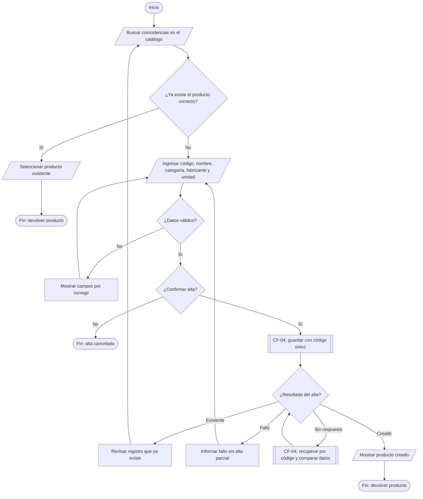
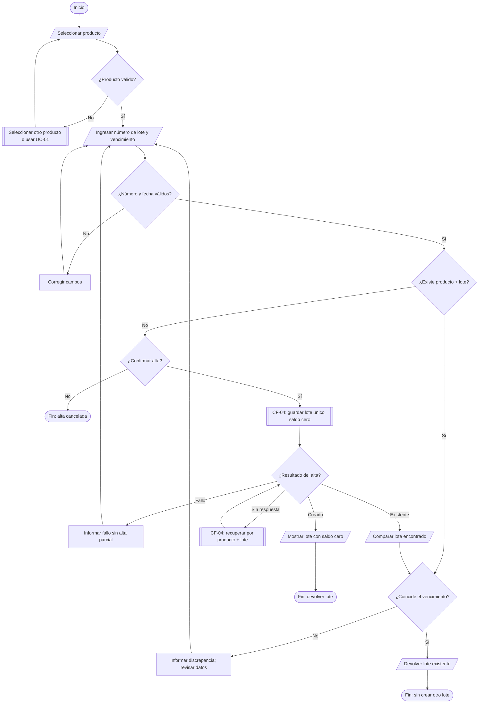
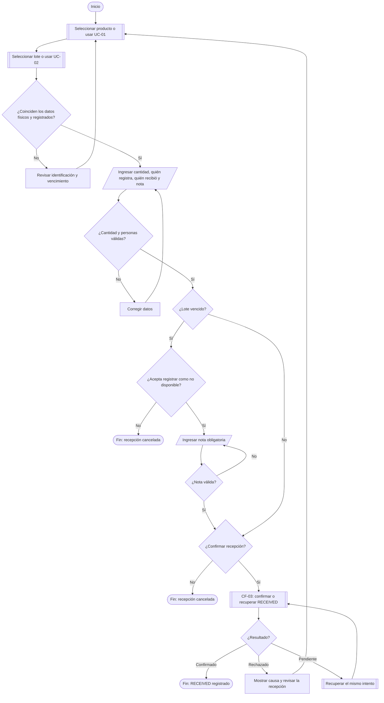
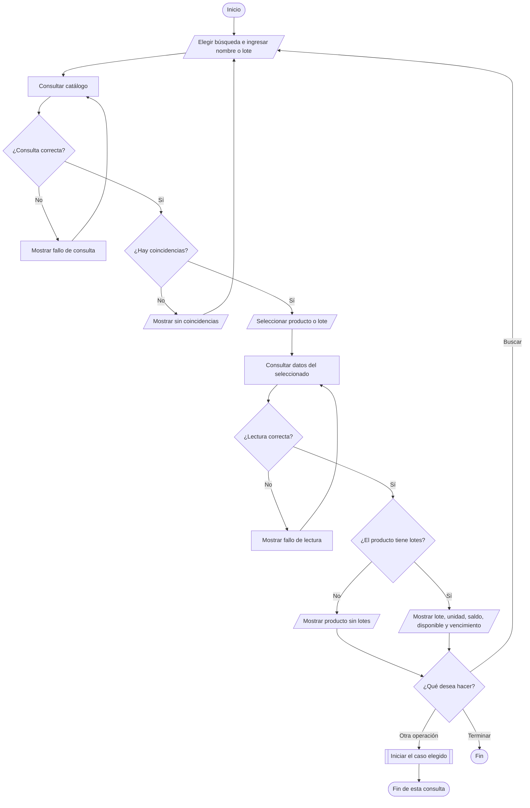
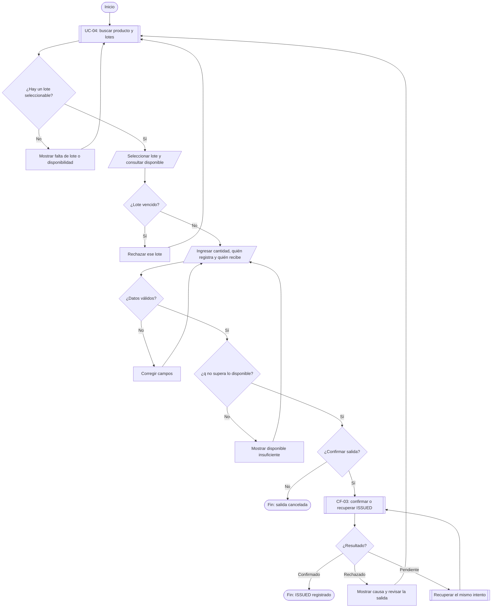
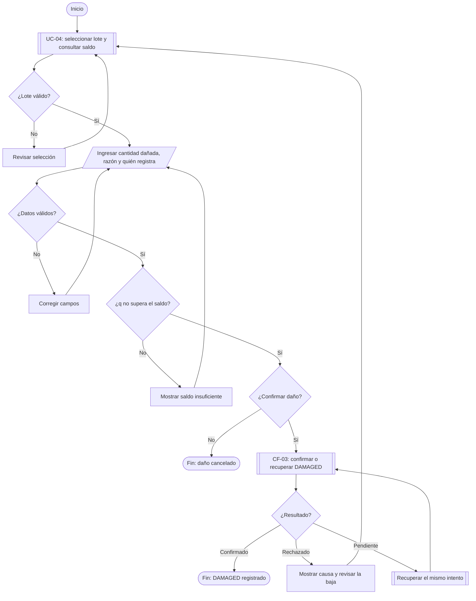
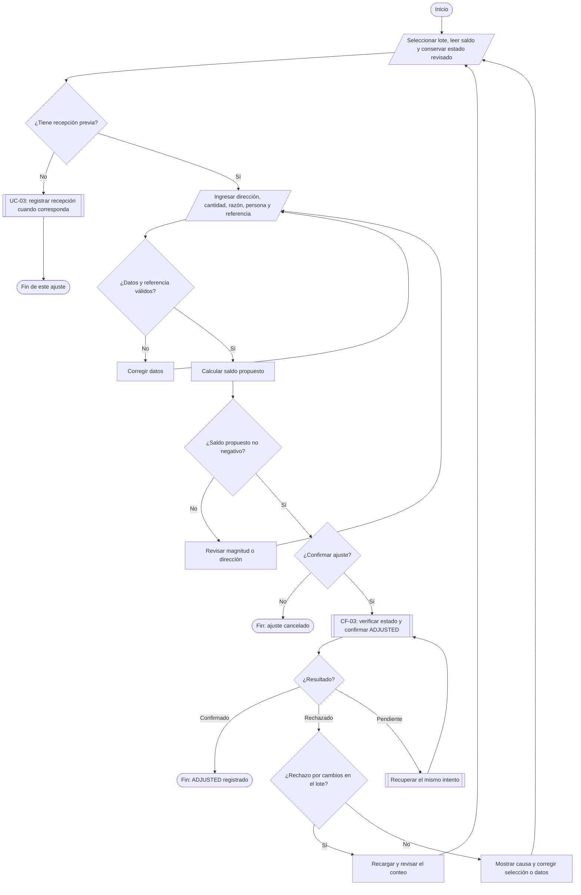
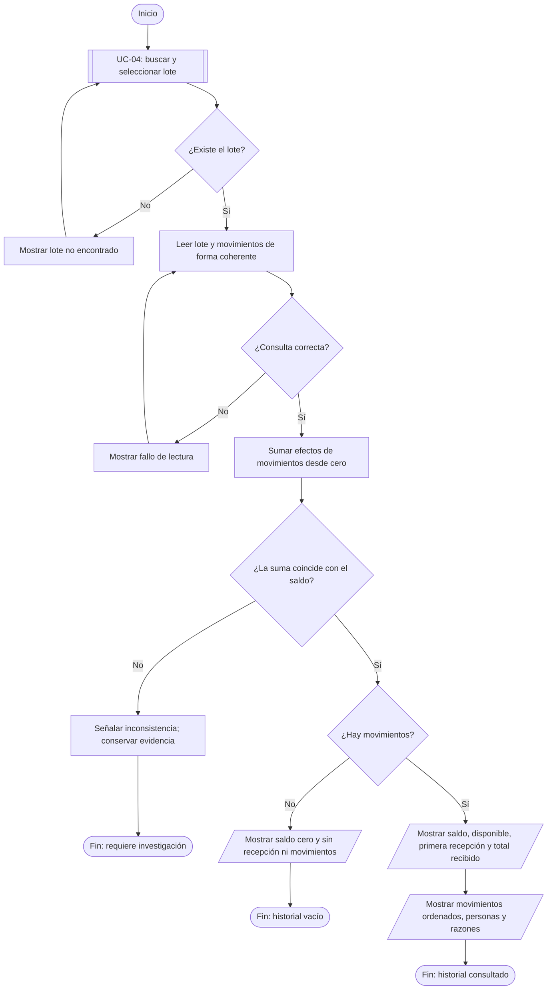
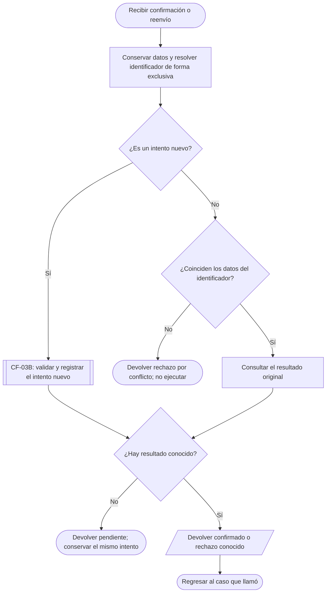
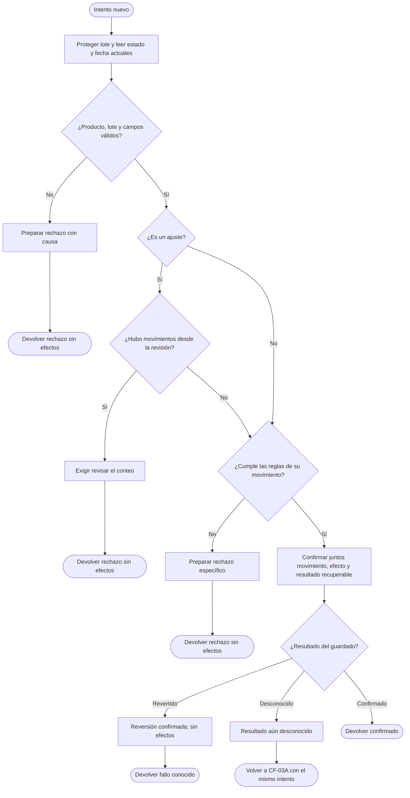

# Laboratory Inventory Management System
## Diagramas de flujo - MVP v2.0

**Fecha:** 2026-09-09.  
**Base:** USE_CASES_MVP_v2.0.md, MVP_Laboratory_Inventory_System_v2.0.md y PROJECT_CHARTER_Laboratory_Inventory_System_v2.0.md.  
**Alcance:** ocho diagramas de casos de uso y CF-03 dividido en dos paneles de detalle. Los paneles de CF-03 no son casos de uso adicionales.

## Cómo leerlos

| Forma | Significado |
| --- | --- |
| Terminal redondeado | Inicio, fin o devolución de resultado. |
| Rectángulo | Acción del sistema o paso de trabajo. |
| Paralelogramo | Capturar o mostrar información. |
| Rombo | Decisión; seguir la flecha con la respuesta correspondiente. |
| Rectángulo con doble borde lateral | Subproceso descrito por otro caso o comportamiento común. |

Cada caso es independiente: registrar daño no exige haber realizado una salida antes. Los rectángulos UC-01/UC-02 dentro de recepción permiten seleccionar un registro existente o invocar el alta cuando falta; no obligan a crearlo cada vez.

Las comprobaciones previas ayudan a corregir formularios. En UC-03/05/06/07, CF-03 repite las comprobaciones determinantes al confirmar y realiza el guardado protegido. Las verificaciones previas por sí solas no garantizan stock ni vigencia.

**Cancelar:** desde una captura o búsqueda puede terminarse sin enviar. Las flechas de cancelación en la revisión representan ese comportamiento común, sin repetirlas en cada campo. Después del envío, cerrar no deshace ni demuestra el fracaso de la operación: se recupera el resultado del mismo intento.

**Resultados de CF-03:** Confirmado termina con el movimiento registrado; Rechazado muestra una causa y permite revisar el formulario; Pendiente conserva identificador y datos y recupera el resultado. La vuelta a revisar una operación conserva los datos que no necesitan corrección. Si el intento fue rechazado, la nueva confirmación usa un identificador nuevo.

**CF-04 en las altas:** guardar con unicidad, recuperar un registro existente y comparar sus datos, o resolver una respuesta perdida por código de producto / combinación producto-lote. Mientras una recuperación no se resuelve, permanece en ese subproceso. Un fallo de consulta no prueba que el alta no exista. La v2.0 no permite sobrescribir metadatos de catálogo.

El PDF contiene los mismos nodos y conexiones; el Markdown conserva Mermaid editable. Los retornos hacia puntos distintos usan canales separados. Un cruce de líneas sin punto de unión no cambia el destino indicado por la flecha. Los saltos entre casos y los detalles de CF-03 se nombran explícitamente para mantener legibles los diagramas.

## UC-01 - Registrar producto

**Actor o ámbito:** Personal de inventario.

- El código es único; el usuario debe revisar también las variantes del material. Cambiar el código no justifica duplicar un producto.
- CF-04 comprueba unicidad al guardar. Si se pierde la respuesta, recupera por código y compara datos. No sobrescribe el registro encontrado.
- Crear o seleccionar un producto no genera stock ni movimientos.

**Referencia:** BR-11, BR-12, BR-17, BR-23, BR-24; CF-04.

## UC-02 - Registrar lote

**Actor o ámbito:** Personal de inventario.

- La clave es producto + número de lote normalizado. Un lote existente conserva su saldo y su historial.
- Crear el lote no es recibir unidades: comienza con saldo cero, sin movimientos y sin fecha de primera recepción.
- Se permite dar de alta un lote vencido. Recibirlo exige la advertencia y aceptación de UC-03. Un vencimiento diferente no se sobrescribe.

**Referencia:** BR-01, BR-02, BR-11, BR-12, BR-13, BR-14; CF-04.

## UC-03 - Registrar recepción

**Actor o ámbito:** Personal de inventario.

- CF-03 vuelve a validar al confirmar. Si el lote venció desde la revisión, se rechaza ese intento y se exige nota y aceptación antes de una nueva confirmación.
- Un lote ya registrado recibe otro RECEIVED; no se crea de nuevo. La recepción aumenta saldo en q. Si está vencido, disponible sigue en cero.
- Cancelar conserva las altas de producto o lote que ya fueron confirmadas. La cantidad recibida excluye unidades rechazadas por daño antes de incorporarlas.

**Referencia:** BR-01, BR-03, BR-08, BR-10, BR-12, BR-13, BR-15, BR-19, BR-21, BR-23; CF-03.

## UC-04 - Buscar y consultar inventario

**Actor o ámbito:** Personal de inventario y consumidor.

- Una búsqueda vacía muestra productos. Nombre: coincidencia parcial; número de lote: coincidencia exacta después de normalizar.
- Distinguir sin recepción, agotado y vencido. El lote vencido puede conservar saldo positivo y mostrar disponible cero.
- Los errores de lectura no significan inventario cero. Consultar no reserva unidades. Desde cualquier búsqueda se puede terminar sin modificar datos.

**Referencia:** BR-02, BR-04, BR-06, BR-11, BR-12, BR-18, BR-22, BR-24.

## UC-05 - Registrar salida

**Actor o ámbito:** Consumidor de inventario.

- Las comprobaciones de pantalla son previas. CF-03 repite vigencia, cantidad y disponibilidad sobre el estado actual y protege el guardado frente a operaciones simultáneas.
- Si hay 10 unidades y dos personas intentan retirar 8, solo una salida puede confirmarse. La otra recibe rechazo y debe revisar el disponible.
- No hay reserva, salida parcial ni cambio automático de lote. Reenviar una confirmación ya registrada recupera su resultado sin volver a descontar.

**Referencia:** BR-01, BR-03, BR-04, BR-05, BR-06, BR-08, BR-10, BR-18, BR-19, BR-21; CF-03.

## UC-06 - Registrar daño

**Actor o ámbito:** Personal de inventario.

- Este caso compara contra saldo, no contra disponible para salida. Un lote vencido con saldo positivo admite una baja por daño.
- La razón es obligatoria. Solo se dan de baja unidades todavía incluidas en el saldo; no se descuentan de nuevo unidades ya retiradas.
- CF-03 vuelve a comprobar saldo y campos antes de confirmar un único DAMAGED junto con su efecto.

**Referencia:** BR-01, BR-03, BR-04, BR-07, BR-08, BR-10, BR-19, BR-21; CF-03.

## UC-07 - Registrar ajuste

**Actor o ámbito:** Personal de inventario.

- La cantidad es la diferencia: para pasar de 50 a 47 se elige disminuir 3. Magnitud cero no es válida; llegar a saldo cero sí puede serlo.
- CF-03 detecta cualquier movimiento posterior al estado revisado, aunque el saldo vuelva al mismo número. Requiere revisar el conteo y una nueva confirmación.
- La referencia de corrección, cuando corresponde, debe existir y pertenecer al lote. El ajuste agrega un movimiento; no edita el original ni cambia el vencimiento.

**Referencia:** BR-03, BR-04, BR-08, BR-09, BR-10, BR-16, BR-19, BR-20, BR-21; CF-03.

## UC-08 - Consultar historial del lote

**Actor o ámbito:** Personal de inventario.

- Los lotes agotados o vencidos permanecen consultables. La disponibilidad se explica con saldo y vencimiento; el saldo se explica con los movimientos.
- Sin movimientos, la suma es cero. Un fallo de lectura no equivale a historial vacío. Si existe un saldo almacenado inconsistente, se señala antes de mostrarlo como correcto.
- Esta consulta no edita ni elimina datos. Un ajuste no debe ocultar un fallo interno entre saldo e historial.

**Referencia:** BR-04, BR-06, BR-09, BR-10, BR-12, BR-22, BR-24.

## CF-03A - Confirmación y recuperación de resultado

**Actor o ámbito:** Subproceso común de UC-03, UC-05, UC-06 y UC-07.

- Un identificador repetido con los mismos datos recupera su resultado. No pasa otra vez por CF-03B ni vuelve a validar el stock o el vencimiento actuales.
- En curso, timeout o respuesta perdida no significan rechazo. La recuperación puede quedar pendiente y reanudarse; no se crea un identificador nuevo a ciegas.
- Tras un rechazo conocido, corregir y confirmar constituye un nuevo intento. El resultado recuperado es histórico; cualquier saldo actual se muestra como consulta separada.

**Referencia:** BR-08, BR-19, BR-21, BR-23, BR-24; CF-03.

## CF-03B - Validación final y guardado indivisible

**Actor o ámbito:** Solo para un intento nuevo admitido por CF-03A.

- RECEIVED: entero positivo, participantes, datos de lote coherentes; si vencido, nota y aceptación. ISSUED: vigente y q no supera disponible.
- DAMAGED: razón y q no supera saldo. ADJUSTED: recepción previa, dirección, razón, referencia válida y saldo resultante no negativo.
- La protección incluye lectura final, validación y guardado; no la captura humana ni la espera de respuesta. Si no puede conocerse el resultado, se recupera mediante CF-03A. Nunca hay éxito parcial.

**Referencia:** BR-01 a BR-10, BR-13 a BR-16, BR-19 a BR-24; CF-03.

## Comprobación de correspondencia

Los ocho casos conservan sus decisiones de la v2.0. Cada nodo es alcanzable desde su inicio; cada rombo tiene salidas identificadas; los rechazos permiten corregir o terminar. Las rutas de confirmación repetida no ejecutan otra vez CF-03B.

Los escenarios de aceptación que deben recorrerse al implementar siguen siendo los 38 de la v2.0. La revisión de estos dibujos verifica correspondencia y legibilidad; no constituye una prueba del software.
